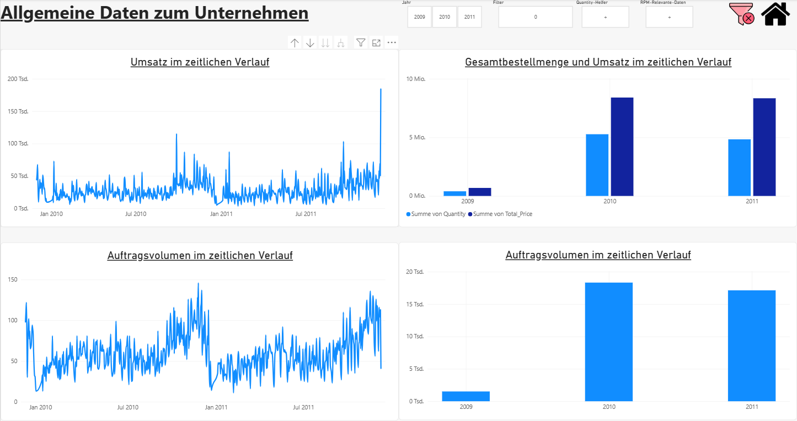
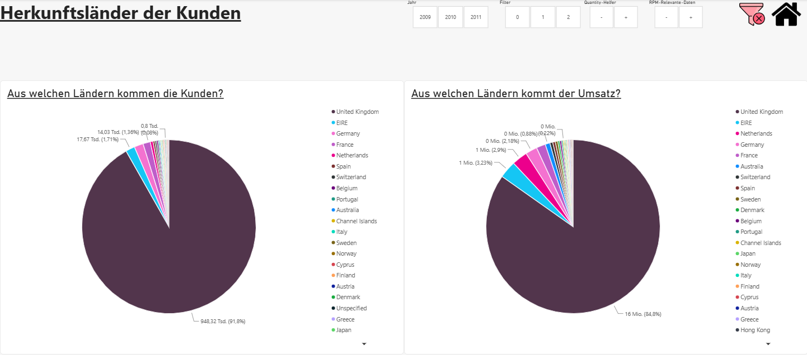
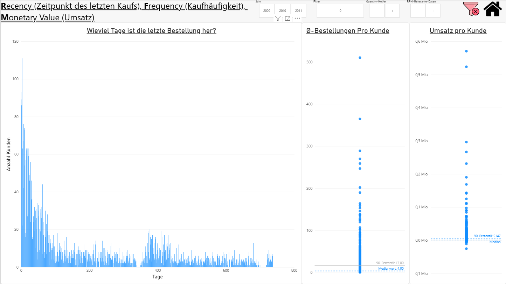
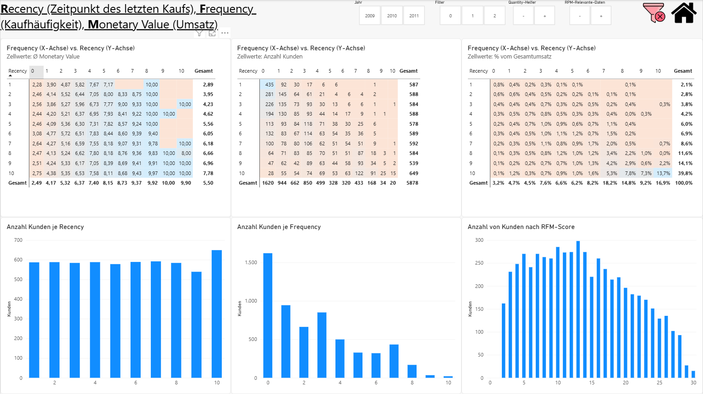
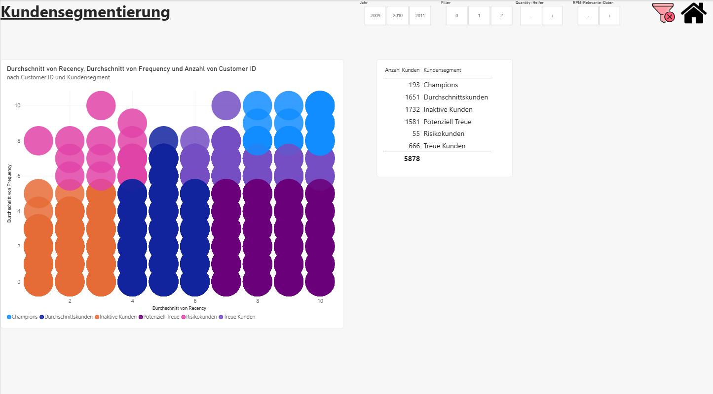

## Ausführlicher Projektbericht mit allen Power BI Visuals

Auf diesen Charts sieht man den Umsatz und das Auftragsvolumen von Dez (2009) - 2011. Auffallend ist der Anstieg in diesen Kennzahlen im November, vermutlich aufgrund von Weihnachtseinkäufen. Insgesamt unterscheiden sich die Zahlen von 2011 kaum von 2010. 2009 haben wir nur Daten von einem Monat, weswegen hier die Zahlen sehr viel kleiner sind.

Es gibt noch einige andere Länder unter den Kunden außer dem Vereinigten Königreich. Die anderen Länder machen von der Kundenzahl allerdings nur 8 % aus. Beim Umsatz generieren die Restländer jedoch sogar 15%. Daraus resultiert, dass diese Länder pro Kopf fast doppelt so viel Umsatz generieren, als die Inlandskunden.

Sehr interessant aus wirtschaftlicher Sicht ist die Kundensegmentierung über das RFM-Modell. RFM steht für:
Recency (Zeitpunkt des letzten Kaufs), 
Frequency (Kaufhäufigkeit), 
Monetary Value (Umsatz).

Nachfolgend die ersten Charts, um über den Stand der Kunden hinsichtlich RFM zu informieren.

Recency (Zeitpunkt des letzten Kaufs): Hier gibt es sehr viele Kunden, die kürzlich ihre letzte Bestellung aufgaben. Ein großer Spike befindet sich hier nur wenige Tage her (seit Ende der Daten). Die ersten ca 100 Tage sind verantwortlich für eine prägnante Rechtsschiefe. Danach gibts bis auf ein leicht höheres Aufkommen bei der 400 Tage Marke ein ausgewogenes Bild bei der Anzahl Kunden.

Frequency (Kaufhäufigkeit): In diesem Streudiagramm machen 90% der Punkte in Wahrheit eigentlich nur 10% der Bestellungen pro Kunde aus. Die 90. Perzentil linie (17 Bestellungen) 
und der Medianwert befinden sich ganz unten. Der typische Kunde hat 4 Bestellungen getätigt. 

Monetary Value (Umsatz): Hier haben wir ein ähnliches Bild wie bei der Frequency. Das was in Wirklichkeit 90% ausmacht, geht aufgrund der sehr hohen Ausreißer in der Grafik total unter. 

Auf der 2. Seite der RFM-Analyse kommen weitere Erkenntnisse zum Vorschein. Bei den 3 Charts Oben handelt es sich um eine Heatmap. Sie veranschaulichen sehr viele detaillierte Informationen, sind dafür allerdings etwas schwieriger zum Lesen.

Auf der X-Achse befindet sich jeweils die Frequency, auf der Y-Achse die Recency. Die Zellwerte unterscheiden sich in den 3 Charts (siehe Untertitel). Über eine bedingte Formatierung sind die Zellwerte je nachdem ob sie sich eher bei Minimun oder Maximum befindet anders gefärbt.

Im ersten Chart sieht man, wie der monetäre Wert deutlich nach rechts zunimmt, was logisch ist, da bei mehr Bestellungen auch wahrscheinlich mehr Umsatz getätigt wird. 
Im zweiten Chart wird gut veranschaulicht, dass die meisten Kunden selten bestellen. Der dritte Chart zeigt deutlich, dass viele Bestellungen auch viel Umsatz bedeutet.

Beim dezidierten Recency-Chart (4. Chart, 1. von Unten) fällt die komplett flache Verteilung auf. Das ist rückblickend kein Wunder. Die Einteilung der Bins auf der Recency- und Monetary Value Skala basiert auf der Anzahl der Kunden in den entsprechenden Perzentilen. Ich habe die Bins in 10er Schritte eingeteilt (die jeweils nächsten 10 Perzentile).

**Bins Einteilung beim RFM-Modell:**

Da ich bis dato im Detail nicht wirklich mit der gängigen Praxis der Bins-Einteilung vertraut war, habe ich Entscheidungen getroffen, deren Konsequenzen mir erst nicht wirklich bewusst waren.

Recency wurde zunächst fälschlich aus dem durchschnittlichen Bestellabstand abgeleitet. Das führte zu wenig-aussagenden Charts, da der durchschnittliche Bestellabstand mathematisch eng mit Frequency verknüpft ist (viele Bestellungen führen zu kurzen Abständen). Nach Korrektur auf 'Zeit seit letzter Bestellung' zeigte sich ein deutlich konsistenteres Muster (Details siehe **`2026-09-24-online_retail_analyse.ipynb`**). 

Frequency wurde bewusst nicht perzentilbasiert, sondern mit sorgfältig überlegten Business-Schwellen gebinnt, da die Verteilung stark rechtsschief ist. Bins auf Pezentilbasis hätten den unteren Bereich zu grob komprimiert. Ich wollte aber die Käufergruppen klarer voneinander trennen.

Zuletzt auf dem RFM-Score sieht man wieder eine deutliche Rechtsschiefe. Dies ist wahrscheinlich im Wesentlichen der anderen Einteilung der Frequency geschuldet.

Im letzten Chart sieht man anhand welcher Kriterien die Kunden segmentiert werden. Die Champions haben in allen Kategorien mindestens 8 Punkte. Die Inaktiven Kunden sind diejenigen die bei Recency und Frequency schlechter abschneiden.

Insbesondere die Risikokunden, die früher häufiger gekauft haben aber seit längerem ruhig geworden sind, sollten mit gezielten Marketing-Maßnahmen adressiert werden.

Und hiermit kommen wir auch zu meiner finalen Handlungsempfehlung:

Die Risikokunden (nur 55) sollten kontaktiert werden und wieder gewonnen werden als aktive Kunden. Auch für die Champions und die treuen Kunden lohnt es sich Strategien zu überlegen, wie wir diese Kunden noch stärker an uns binden können.